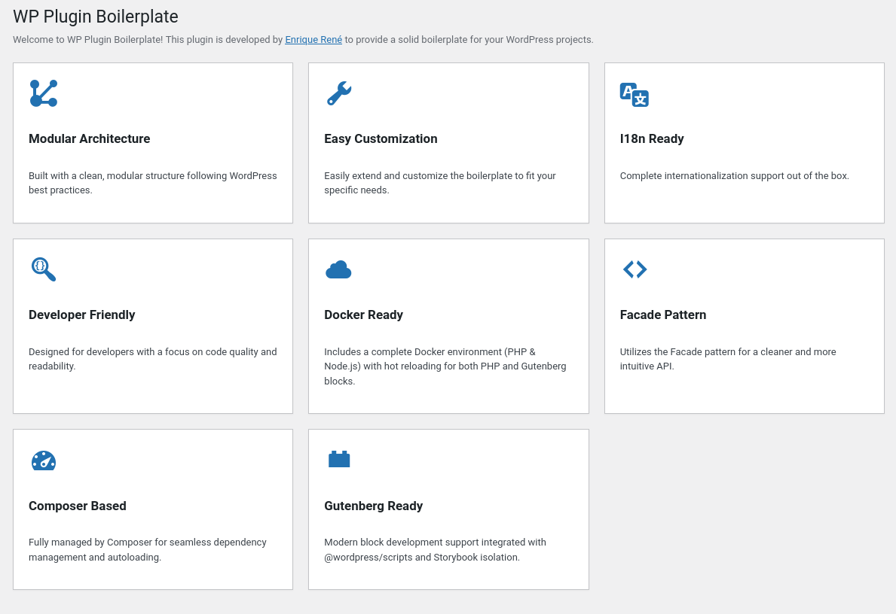

# WP Plugin Boilerplate

A professional, feature-rich WordPress plugin boilerplate designed for modern development workflows. This boilerplate provides a solid foundation for building scalable and maintainable WordPress plugins, leveraging best practices, design patterns, and a robust Docker-based development environment.



### Key Features

-   **Modular Architecture**: Built with a clean, modular structure following WordPress best practices to ensure maintainability.
-   **Gutenberg Ready**: Modern block development support integrated with `@wordpress/scripts` and Storybook.
-   **Docker Ready**: Includes a complete Docker environment (WordPress + MySQL) for instant development.
-   **Developer Friendly**: Designed with a focus on code quality, readability, and ease of customization.

---

### Storybook & Blocks

We use **Storybook** to develop and document our Gutenberg blocks in isolation. This ensures that UI components are consistent, well-tested, and easy to preview without needing a full WordPress installation active during the design phase.

**Currently Implemented Blocks:**
- **Social Card**: A versatile block for featuring content with an image, title, and description.
- **Author Presentation**: A specialized block designed to showcase author details or specific integrations with an elegant overlapping layout.

---

### Quick Guide

Short checklist to rename this boilerplate and run it locally with Docker.

#### Current identifiers
- Name: `WP Plugin Boilerplate`
- Slug: `wp-plugin-boilerplate`
- Namespace: `WPPB`
- Text domain: `plugin-name`
- Main file: `plugin-name.php`

#### Rename in these places
1) `src/Core/Constants.php`
   - `PLUGIN_NAME`, `PLUGIN_BASE_NAME`
2) `plugin-name.php`
   - Header fields (Plugin Name, Text Domain) and keep `WPPB_PLUGIN_BASENAME`
3) Optional
   - Namespace `WPPB` (update `composer.json` → `autoload.psr-4` and run `composer dump-autoload`)
   - Rename `plugin-name.php` to your slug file

Suggested searches: `WP Plugin Boilerplate`, `wp-plugin-boilerplate`, `WPPB`, `plugin-name`.

---

### Local Development (Docker)

This repo ships with `docker-compose` for a quick WordPress + MySQL stack, including PHP (Composer) and Node.js environments.

What you get
- WordPress: `wordpress:6.7.1-php8.3-apache` on http://localhost:8080
- MySQL: `mysql:8.0` with DB `wordpress` / user `wordpress` / pass `wordpress`
- Your plugin is mounted into `/var/www/html/wp-content/plugins/wp-plugin-boilerplate`
- Composer auto-run: a one-shot `composer:2` service runs `composer install` for the plugin on `docker compose up`.
- Node.js auto-run: a `node:22` service runs `npm install` and `npm run start` (watch mode) on `docker compose up`.
- Storybook: accessible via http://localhost:6006 (runs inside the Node container).

Run
```bash
docker compose up -d
```

Visit http://localhost:8080 to finish the WordPress installer. Then activate “WP Plugin Boilerplate” in Plugins.

Stop & remove
```bash
docker compose down
```

Wipe DB volume too
```bash
docker compose down -v
```

#### Node.js Commands (via Docker)

To run build:
```bash
docker compose run --rm node npm run build
```

To run storybook (manually if not started):
```bash
docker compose run --rm -p 6006:6006 node npm run storybook
```

To run lint:
```bash
docker compose run --rm node npm run lint:js
```

Notes
- UID/GID: The Composer and Node services run as `${UID}:${GID}` (defaults to 1000:1000). On Linux, export your IDs before first run for correct file ownership:
  - `export UID=$(id -u) && export GID=$(id -g)`
  - Or create a `.env` file with `UID=…` and `GID=…`.
- Re-run Composer manually: `docker compose run --rm composer`
- Debug: WP_DEBUG is enabled by default in Docker via `WORDPRESS_DEBUG=1`. Set to `0` in `docker-compose.yml` to disable.

---

### Hot Reload (PHP)

- Enabled by default in dev: `DEV_HOT_RELOAD=1` (set in docker-compose.yml).
- What it does:
  - Mounts a PHP ini override enabling instant OPCache revalidation.
  - Loads an MU-plugin that calls `opcache_reset()` on each request in dev.
- To disable: set `DEV_HOT_RELOAD=0` (or remove) and `docker compose up -d`.

---

### About Author
- **Webpage**: [enriquerene.com](https://enriquerene.com)
- **GitHub**: [enriquerene/wordpress-plugin-boilerplate](https://github.com/enriquerene/wordpress-plugin-boilerplate)
- **Medium**: [@enriquerenebr](https://medium.com/@enriquerenebr)
- **LinkedIn**: [enriquerenebr](https://www.linkedin.com/enriquerenebr)
- **Stack Overflow**: [Enrique René](https://stackoverflow.com/users/5382576/enrique-ren%C3%A9)
